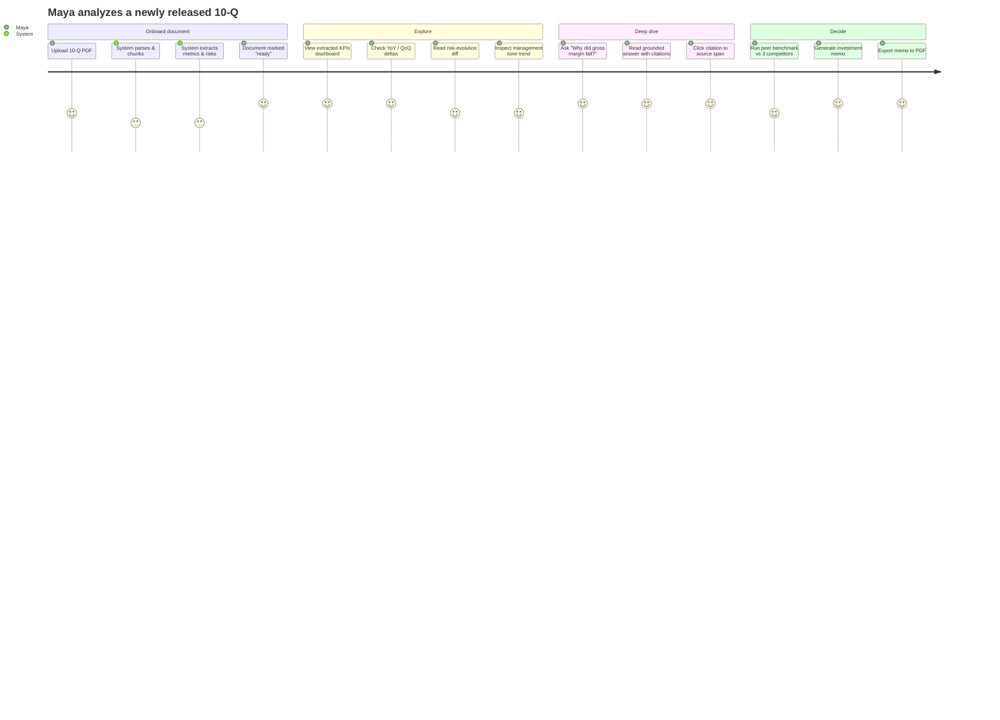
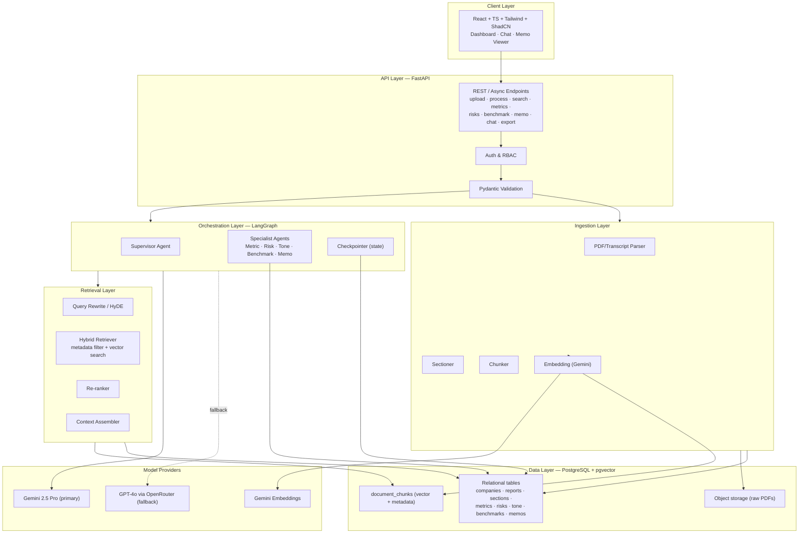
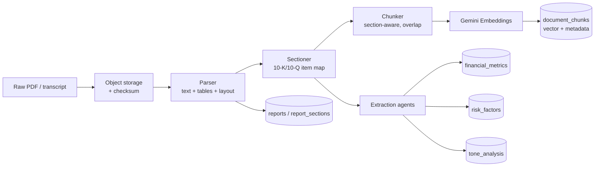
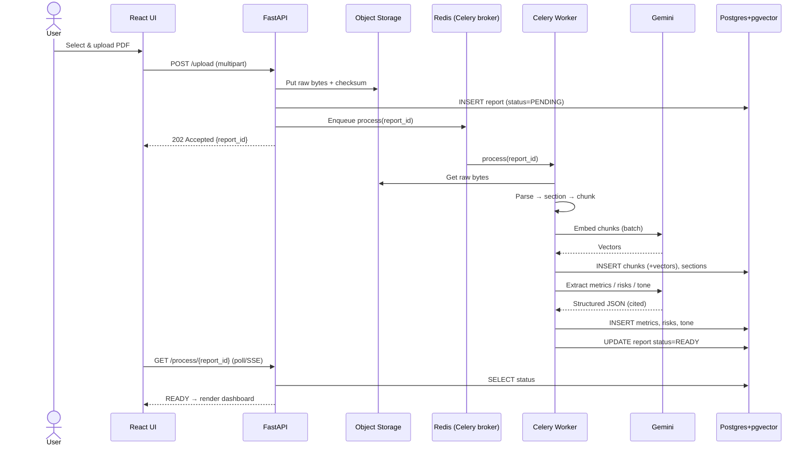
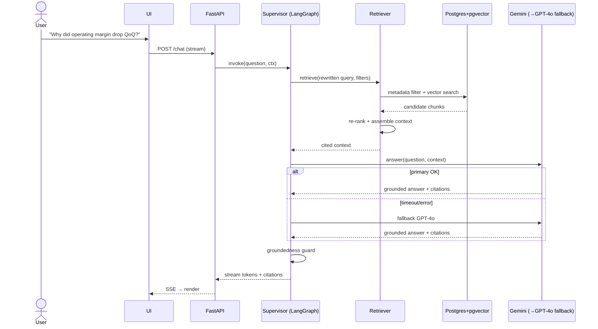
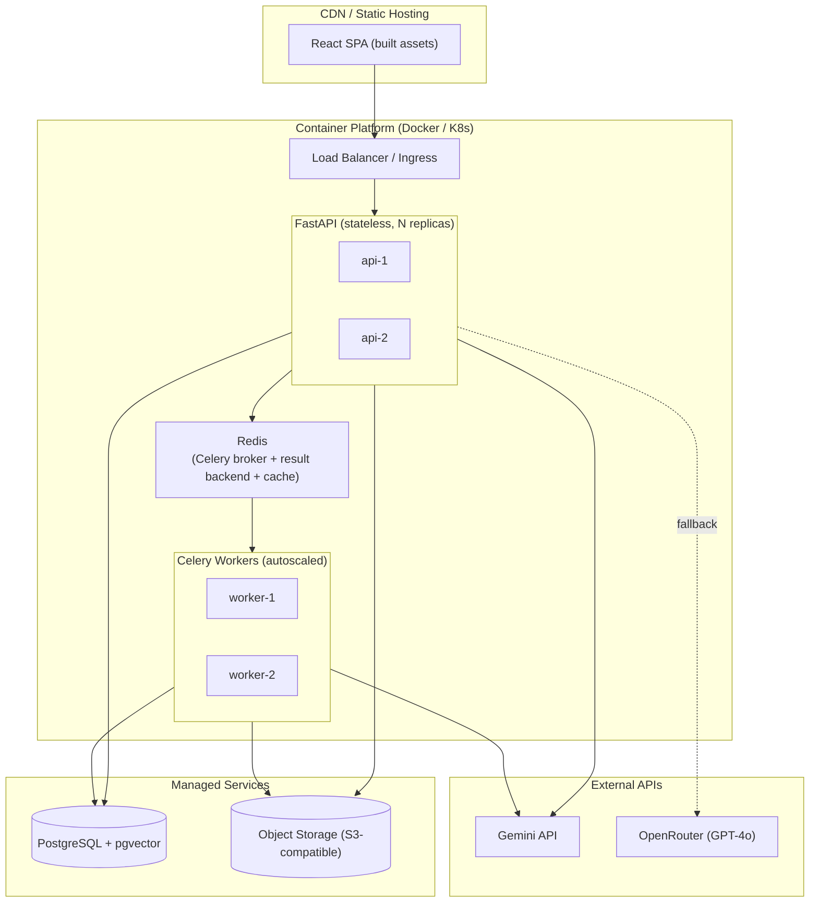
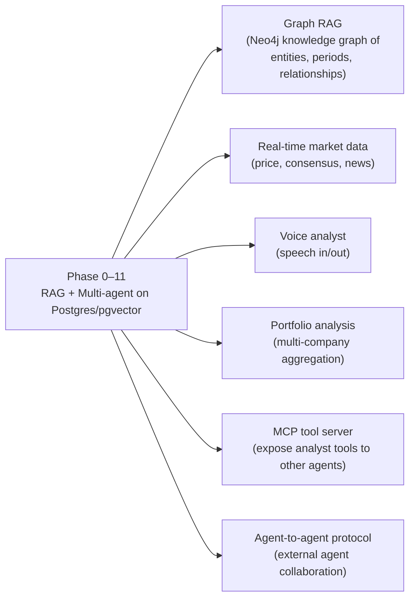

# 01 — System Architecture

> **Document status:** Phase 0 (Foundation)
> **Last updated:** 2026-06-10
> **Owners:** Architecture / Platform
> **Audience:** New engineers, technical evaluators, reviewers

---

## Table of Contents

1. [Project Overview](#1-project-overview)
2. [Problem Statement](#2-problem-statement)
3. [Business Objectives](#3-business-objectives)
4. [User Journey](#4-user-journey)
5. [High-Level Architecture](#5-high-level-architecture)
6. [System Layers](#6-system-layers)
7. [Data Flow](#7-data-flow)
8. [Component Responsibilities](#8-component-responsibilities)
9. [Sequence Diagrams](#9-sequence-diagrams)
10. [Deployment Architecture](#10-deployment-architecture)
11. [Cross-Cutting Concerns](#11-cross-cutting-concerns)
12. [Assumptions & Constraints](#12-assumptions--constraints)
13. [Future Architecture Evolution](#13-future-architecture-evolution)

---

## 1. Project Overview

**AI Financial Document Analyst** is a production-grade Retrieval-Augmented Generation (RAG) and multi-agent platform that ingests financial disclosures — annual reports (10-K), quarterly filings (10-Q), and earnings call transcripts — and produces grounded, citation-backed analysis.

The platform automates work that today consumes most of a junior-to-mid financial analyst's day:

| Analyst task | Platform capability |
|---|---|
| Reading 200-page filings | Automated parsing, sectioning, and chunking |
| Pulling KPIs into a model | Structured **financial metric extraction** |
| Building trend tables | **YoY / QoQ comparison** |
| Reading the risk factors section | **Risk extraction + risk-evolution tracking** |
| Judging management confidence | **Tone & sentiment analysis** |
| Comparing peers | **Competitor benchmarking** |
| Writing the memo | **Investment memo generation** |
| Answering ad-hoc questions | **Conversational analyst (grounded Q&A)** |

The defining constraint is **trust**: every claim the system makes must be traceable to a specific span of a specific source document. The architecture is therefore built around *grounded generation* — retrieval and structured extraction feed the LLM, and every output carries citations.

### Design principles

1. **Grounded over fluent.** A citation-less answer is a defect, not a feature.
2. **Structured data is first-class.** Extracted metrics live in relational tables, *not* only in vector chunks, so they can be queried, aggregated, and verified deterministically.
3. **Unified storage.** PostgreSQL + `pgvector` holds both relational and vector data to minimize infrastructure surface area.
4. **Deterministic where possible, generative where necessary.** Use SQL/maths for arithmetic (growth %, ratios); use the LLM for language understanding and synthesis.
5. **Stateful, inspectable agents.** LangGraph gives checkpointed, replayable workflows we can debug and audit.
6. **Fail loud, degrade gracefully.** Fallback LLM, retry policies, and explicit "insufficient evidence" responses instead of hallucinated confidence.

---

## 2. Problem Statement

Financial analysis is **document-heavy, repetitive, and error-prone**:

- A single 10-K can exceed 200 pages; an analyst covers dozens of companies.
- Critical numbers are buried in tables, footnotes, and MD&A prose.
- Comparing this quarter to last, or this company to a peer, requires manually reconciling inconsistent terminology ("revenue" vs "net sales" vs "total turnover").
- Risk disclosures evolve subtly across periods; the *change* is the signal, and it is easy to miss.
- Management tone is qualitative and rarely tracked systematically.

Generic LLM chatbots fail here because they:

- **Hallucinate** numbers that look plausible but are wrong — unacceptable in finance.
- Lack **citations**, so output cannot be audited.
- Cannot reliably do **multi-document, multi-period** reasoning within a context window.
- Treat a financial table as unstructured text, losing the row/column semantics.

**The problem we solve:** turn a pile of unstructured filings into a queryable, comparable, citation-grounded knowledge base, and layer specialist agents on top that reason over it the way a disciplined analyst would.

---

## 3. Business Objectives

| # | Objective | Measurable target (Phase-level) |
|---|---|---|
| BO-1 | Reduce time-to-first-insight on a new filing | < 5 minutes from upload to queryable |
| BO-2 | Eliminate fabricated numbers | 100% of reported metrics carry a source citation; extraction accuracy ≥ 95% on labeled set |
| BO-3 | Enable cross-period analysis | Automated YoY/QoQ for all extracted metrics |
| BO-4 | Surface risk evolution | Detect added/removed/modified risk factors across periods |
| BO-5 | Provide auditable answers | Every chat answer cites ≥ 1 chunk; "no answer" when evidence is absent |
| BO-6 | Generate analyst-grade memos | Structured memo with metrics, risks, tone, and a recommendation, fully cited |
| BO-7 | Keep infra simple & cost-efficient | Single primary datastore; Gemini-first with bounded fallback spend |

### Non-goals (Phase 0–11)

- Real-time market/price data ingestion (Phase 12 / future).
- Trade execution or portfolio management.
- Regulatory/compliance certification (the tool *assists*, it does not *advise* in a fiduciary sense).

---

## 4. User Journey

**Primary persona:** *Maya*, a buy-side equity analyst covering 30 names.

### Step-by-step

1. **Upload** — Maya drops a 10-Q PDF (or selects a known ticker/period).
2. **Process** — async pipeline parses, sections, chunks, embeds, and runs extraction agents. Maya sees a progress indicator.
3. **Review** — a dashboard shows extracted metrics with citations, YoY/QoQ, risk diffs, and a tone gauge.
4. **Converse** — Maya asks free-form questions; answers are grounded and cited; she can click through to the source.
5. **Benchmark** — Maya selects peers; the system aligns comparable metrics and renders a comparison.
6. **Synthesize** — Maya generates an investment memo, edits if needed, and exports.

---

## 5. High-Level Architecture

The system is a layered, mostly-async pipeline. The **ingestion layer** turns raw documents into structured + vectorized knowledge. The **retrieval layer** serves grounded context. The **orchestration layer** (LangGraph) coordinates specialist agents. Everything persists in a single **PostgreSQL + pgvector** datastore (raw binaries in object storage).

---

## 6. System Layers

### 6.1 Client Layer
React + TypeScript SPA. Tailwind + ShadCN for the component system. Responsibilities: file upload, dashboards (metrics/risk/tone), chat with inline citations, benchmark tables, memo viewer/export. Talks only to the FastAPI layer.

### 6.2 API Layer (FastAPI)
The single ingress. Responsibilities: authentication/authorization, request validation (Pydantic), rate limiting, kicking off async jobs, streaming chat responses (SSE), and serving read models. Stateless and horizontally scalable.

### 6.3 Orchestration Layer (LangGraph)
Holds the multi-agent graph. The **Supervisor** routes a request to the right specialist(s), manages shared state, and aggregates results. State is checkpointed so long-running analyses are resumable and auditable. (Full detail in `03_AGENT_DESIGN.md`.)

### 6.4 Retrieval Layer
The RAG engine: query rewriting / HyDE, hybrid retrieval (metadata pre-filter + vector similarity), re-ranking, and context assembly with citation metadata. (Full detail in `05_RETRIEVAL_DESIGN.md`.)

### 6.5 Ingestion Layer
Async workers: parse PDFs/transcripts (preserving tables), detect document structure (sections like *Item 1A Risk Factors*, *MD&A*), chunk with section-aware boundaries, embed via Gemini, and write chunks + extracted entities to the database.

### 6.6 Model Provider Layer
A thin **LLM gateway** abstracts providers: Gemini 2.5 Pro primary, GPT-4o (via OpenRouter) fallback/validation, Gemini Embeddings for vectors. Centralizes retries, timeouts, cost accounting, and prompt/version logging.

### 6.7 Data Layer
PostgreSQL holds relational entities *and* vectors (`pgvector`). Raw PDFs live in object storage (local FS in dev, S3-compatible in prod); the DB stores a pointer + checksum. (Full detail in `02_DATABASE_DESIGN.md`.)

---

## 7. Data Flow

### 7.1 Ingestion data flow

### 7.2 Query (chat) data flow

```mermaid
flowchart LR
    Q["User question"] --> RW["Query rewrite / HyDE"]
    RW --> MF["Metadata filter<br/>(company, period, section)"]
    MF --> VS["Vector search (pgvector)"]
    VS --> RR["Re-rank"]
    RR --> CA["Context assembly + citations"]
    CA --> LLM["Gemini 2.5 Pro"]
    LLM --> ANS["Grounded answer + citations"]
    ANS --> GUARD["Groundedness check"]
    GUARD --> OUT["Response to user"]
```

---

## 8. Component Responsibilities

| Component | Owns | Does NOT own |
|---|---|---|
| **FastAPI gateway** | Auth, validation, routing, job kickoff, streaming | Business reasoning, model calls directly |
| **Ingestion workers** | Parse, section, chunk, embed, persist | Answering user queries |
| **Supervisor agent** | Routing, state, aggregation | Domain-specific extraction logic |
| **Specialist agents** | One analytical task each | Cross-task coordination |
| **Retriever** | Fetch + rank grounded context | Generating final prose |
| **LLM gateway** | Provider abstraction, fallback, cost/log | Prompt content (owned by agents) |
| **PostgreSQL/pgvector** | Durable relational + vector state | Compute / orchestration |
| **Object storage** | Raw document bytes | Structured queries |

---

## 9. Sequence Diagrams

### 9.1 Document upload & processing

### 9.2 Grounded conversational query

---

## 10. Deployment Architecture

### Environments

| Env | Compose | DB | Object storage | Models |
|---|---|---|---|---|
| **Local dev** | Docker Compose | Postgres+pgvector container | Local FS / MinIO | Real APIs (low quota) |
| **Staging** | K8s namespace | Managed Postgres | S3 bucket | Real APIs |
| **Prod** | K8s | Managed Postgres (HA) | S3 (versioned) | Real APIs + fallback |

**Scaling notes:** API pods are stateless → scale on RPS. **Celery workers** scale on **Redis** queue depth. Postgres scales vertically + read replicas for read models; pgvector indexes (HNSW) are memory-sensitive — size accordingly. LLM calls are the dominant cost and latency driver → cache, batch embeddings, and gate spend per request.

**Asynchronous processing (Redis + Celery, ratified ADR-008):** all document processing — parse → chunk → embed → metric/risk/tone extraction — runs as **Celery tasks** brokered by **Redis**, never inside an HTTP request. `/upload` enqueues a job and returns `202`; workers consume the queue, persist results, and update report `status`. Celery provides retries with backoff, task monitoring (e.g. Flower), and independent worker scaling. See `04_API_DESIGN.md` for the request contract and ADR-008 in `06_IMPLEMENTATION_ROADMAP.md` for the full decision.

---

## 11. Cross-Cutting Concerns

- **Observability:** structured logs, request tracing, per-stage timing, token/cost accounting per request, LangGraph run traces.
- **Security:** auth on every endpoint, RBAC, signed URLs for raw docs, secrets in a vault, PII-aware logging. (See `04_API_DESIGN.md`.)
- **Reliability:** idempotent ingestion (checksum dedupe), retries with backoff, primary→fallback LLM, dead-letter for failed jobs.
- **Cost control:** Gemini-first, embedding batching, retrieval caching, fallback only on failure/validation.
- **Data quality:** every extracted metric/risk carries a citation + confidence; low-confidence items flagged for review.
- **Versioning:** prompt versions, embedding model version, and schema migrations are all tracked (re-embedding is a migration event).

---

## 12. Assumptions & Constraints

**Assumptions**
- Source documents are in English and are genuine filings/transcripts.
- PDFs are text-based or OCR-able (scanned-only filings need an OCR pre-step).
- Gemini API quota is sufficient for expected ingestion volume.
- Users are authenticated internal/known analysts (not anonymous public traffic in early phases).

**Constraints**
- Single primary datastore (Postgres + pgvector) is a deliberate simplicity constraint.
- Financial arithmetic (growth %, ratios) must be computed deterministically, not by the LLM.
- No output without a citation path back to source.
- Budgeted LLM spend per document and per query session.

---

## 13. Future Architecture Evolution

- **Graph RAG / Neo4j:** model companies, periods, metrics, and risks as a graph for multi-hop reasoning ("which suppliers appear as risks across my whole portfolio?").
- **Real-time data:** join filings with live prices and consensus estimates.
- **Voice analyst:** conversational STT/TTS front-end.
- **Portfolio analysis:** roll up analysis across a watchlist.
- **MCP tool server:** expose extraction/benchmark/memo capabilities as MCP tools so external agents can call this platform.
- **A2A communication:** let our agents negotiate with external specialist agents.

See `06_IMPLEMENTATION_ROADMAP.md` for phasing and decision records.
