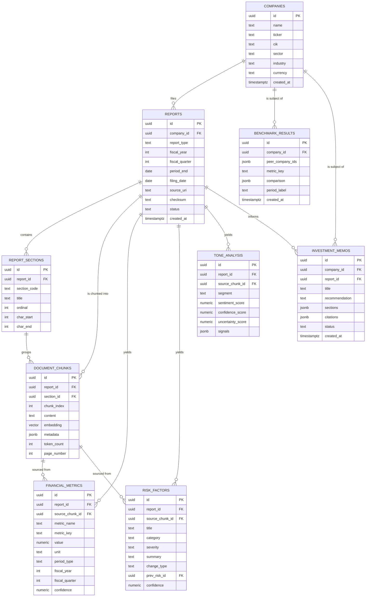

# 02 — Database Design

> **Document status:** Phase 0 (Foundation)
> **Last updated:** 2026-06-10
> **Datastore:** PostgreSQL 16 + `pgvector`
> **Audience:** Backend engineers, data engineers, reviewers

---

## Table of Contents

1. [Design Philosophy](#1-design-philosophy)
2. [ER Diagram](#2-er-diagram)
3. [Conventions](#3-conventions)
4. [Entity Definitions](#4-entity-definitions)
5. [Table Definitions (DDL)](#5-table-definitions-ddl)
6. [pgvector Design](#6-pgvector-design)
7. [Indexing Strategy](#7-indexing-strategy)
8. [Metadata Schema](#8-metadata-schema)
9. [Relationship Mapping](#9-relationship-mapping)
10. [Example Rows](#10-example-rows)
11. [Query Examples](#11-query-examples)
12. [Constraints, Integrity & Migrations](#12-constraints-integrity--migrations)

---

## 1. Design Philosophy

The single most important schema decision is **separating structured financial data from RAG chunks** (see ADR-007 in the roadmap).

- `document_chunks` is the **vector/RAG** surface: text spans + embeddings + metadata for semantic retrieval.
- `financial_metrics`, `risk_factors`, `tone_analysis`, etc. are the **structured analytical** surface: typed, queryable, aggregatable, and *deterministically* computable (growth %, ratios) without invoking an LLM.

**Why both?** Vectors are great for "find the relevant passage" but terrible for "sum revenue across 4 quarters" or "compare margins across 5 companies." Structured tables make arithmetic exact and auditable. Both link back to source chunks for citations.

Every analytical row carries:
- a **provenance** link (which report / section / chunk it came from),
- a **confidence** score, and
- enough context to render a **citation**.

### 1.1 Core principle: *numbers are computed deterministically, not generated by the LLM*

This is a **load-bearing architectural principle** (ratified as **ADR-007**), not a style preference. The tables `financial_metrics`, `risk_factors`, `tone_analysis`, and `benchmark_results` are kept **strictly separate** from `document_chunks`, and all numeric operations run over those structured rows in SQL/Python — never over LLM-generated prose.

**Why this separation is mandatory:**

| Operation | If derived from text (LLM) | If derived from structured rows (our design) |
|---|---|---|
| Growth (YoY/QoQ) | LLM "does arithmetic" → silent off-by-magnitude / hallucinated deltas | `(cur − prev)/prev` in SQL — exact, testable |
| Ratios (margins, leverage) | Plausible-looking but unverifiable | Computed from typed `numeric` values with explicit units |
| Rankings / percentiles | Order can be wrong, ties mishandled | `ORDER BY` / window functions — deterministic |
| Benchmarking across peers | Terminology drift ("net sales" vs "revenue") muddles comparison | Canonical `metric_key` + normalized `unit`/`period_type` |
| Aggregation (sum over quarters) | Context-window dependent, non-reproducible | `SUM()` over rows — reproducible to the cent |

**The division of labor is explicit:**
- The **LLM's job** is *language understanding* — locate the right number/risk/sentiment in the document and **read** it, returning the exact source span for citation.
- The **database's job** is *computation* — every growth rate, ratio, ranking, percentile, and comparison is produced by deterministic SQL/Python over the typed rows the LLM populated.

**Consequences:**
- **Auditability:** any reported figure traces to a stored `numeric` value *and* a `source_chunk_id` quote — re-derivable and inspectable.
- **Reproducibility:** the same inputs always yield the same metric (no temperature, no context truncation effects).
- **Zero arithmetic hallucination:** the LLM is never asked to do math, so it can't get math wrong.
- **Cost/latency:** comparisons and dashboards run as cheap SQL, not repeated LLM calls.

`document_chunks` remains the place for *semantic retrieval of language*; the structured tables remain the single source of truth for *quantities and their relationships*. The small text/row duplication this creates is an accepted, deliberate trade-off. See **ADR-007** in `06_IMPLEMENTATION_ROADMAP.md` for the full record.

---

## 2. ER Diagram



---

## 3. Conventions

- **PKs:** `uuid` (`gen_random_uuid()` via `pgcrypto`), so IDs are non-guessable and merge-safe.
- **Timestamps:** `timestamptz`, UTC, `created_at`/`updated_at` where mutable.
- **Money:** `numeric` (never `float`) for exact arithmetic; magnitude normalized to a `unit` column (e.g. `USD_MILLIONS`).
- **Enums:** modeled as `text` + `CHECK` constraints in Phase 0 (cheap to evolve); promote to native `ENUM` later if stable.
- **Flexible attributes:** `jsonb` for evolving/semi-structured fields (metadata, signals, memo sections).
- **Naming:** `snake_case`, plural table names, `*_id` FKs.
- **Soft delete:** not used in Phase 0; rely on cascade + audit. Reconsider in Phase 11.

---

## 4. Entity Definitions

| Entity | Purpose | Cardinality |
|---|---|---|
| **companies** | Issuer master data (one row per company) | 1 → many reports |
| **reports** | One filing/transcript (10-K, 10-Q, transcript) for a company+period | 1 → many sections/chunks/metrics |
| **report_sections** | Logical structure of a filing (e.g. *Item 1A Risk Factors*, *MD&A*) | 1 → many chunks |
| **document_chunks** | Embedded text spans — the RAG/vector surface | many ← report/section |
| **financial_metrics** | Typed extracted KPIs with provenance | many ← report |
| **risk_factors** | Extracted risks + cross-period evolution links | many ← report |
| **tone_analysis** | Sentiment/confidence/uncertainty per segment | many ← report |
| **benchmark_results** | Cached peer comparisons | many ← company |
| **investment_memos** | Generated, cited memos with a recommendation | many ← company/report |

---

## 5. Table Definitions (DDL)

```sql
-- Extensions
CREATE EXTENSION IF NOT EXISTS pgcrypto;   -- gen_random_uuid()
CREATE EXTENSION IF NOT EXISTS vector;     -- pgvector

-- ---------------------------------------------------------------------------
-- companies
-- ---------------------------------------------------------------------------
CREATE TABLE companies (
    id          uuid PRIMARY KEY DEFAULT gen_random_uuid(),
    name        text NOT NULL,
    ticker      text,
    cik         text,                       -- SEC Central Index Key
    sector      text,
    industry    text,
    currency    text NOT NULL DEFAULT 'USD',
    created_at  timestamptz NOT NULL DEFAULT now(),
    updated_at  timestamptz NOT NULL DEFAULT now(),
    CONSTRAINT uq_companies_ticker UNIQUE (ticker),
    CONSTRAINT uq_companies_cik    UNIQUE (cik)
);

-- ---------------------------------------------------------------------------
-- reports  (one filing/transcript per company + period)
-- ---------------------------------------------------------------------------
CREATE TABLE reports (
    id             uuid PRIMARY KEY DEFAULT gen_random_uuid(),
    company_id     uuid NOT NULL REFERENCES companies(id) ON DELETE CASCADE,
    report_type    text NOT NULL CHECK (report_type IN ('10-K','10-Q','TRANSCRIPT','OTHER')),
    fiscal_year    int  NOT NULL,
    fiscal_quarter int  CHECK (fiscal_quarter BETWEEN 1 AND 4),   -- NULL for 10-K
    period_end     date,
    filing_date    date,
    source_uri     text NOT NULL,           -- object-storage pointer to raw bytes
    checksum       text NOT NULL,           -- sha256 for idempotent ingestion
    status         text NOT NULL DEFAULT 'PENDING'
                     CHECK (status IN ('PENDING','PARSING','EMBEDDING','EXTRACTING','READY','FAILED')),
    error_detail   text,
    created_at     timestamptz NOT NULL DEFAULT now(),
    updated_at     timestamptz NOT NULL DEFAULT now(),
    CONSTRAINT uq_reports_checksum UNIQUE (checksum),
    CONSTRAINT uq_reports_period   UNIQUE (company_id, report_type, fiscal_year, fiscal_quarter)
);

-- ---------------------------------------------------------------------------
-- report_sections  (10-K/10-Q item map, transcript segments)
-- ---------------------------------------------------------------------------
CREATE TABLE report_sections (
    id           uuid PRIMARY KEY DEFAULT gen_random_uuid(),
    report_id    uuid NOT NULL REFERENCES reports(id) ON DELETE CASCADE,
    section_code text,                       -- e.g. 'ITEM_1A','MD&A','QA','PREPARED_REMARKS'
    title        text NOT NULL,
    ordinal      int  NOT NULL,
    char_start   int,
    char_end     int,
    CONSTRAINT uq_section_ordinal UNIQUE (report_id, ordinal)
);

-- ---------------------------------------------------------------------------
-- document_chunks  (RAG / vector surface)
-- ---------------------------------------------------------------------------
CREATE TABLE document_chunks (
    id           uuid PRIMARY KEY DEFAULT gen_random_uuid(),
    report_id    uuid NOT NULL REFERENCES reports(id) ON DELETE CASCADE,
    section_id   uuid REFERENCES report_sections(id) ON DELETE SET NULL,
    chunk_index  int  NOT NULL,
    content      text NOT NULL,
    embedding    vector(EMBEDDING_DIM),     -- EMBEDDING_DIM = TBD — finalized in Phase 2 (see §6)
    metadata     jsonb NOT NULL DEFAULT '{}'::jsonb,
    token_count  int,
    page_number  int,
    created_at   timestamptz NOT NULL DEFAULT now(),
    CONSTRAINT uq_chunk_index UNIQUE (report_id, chunk_index)
);

-- ---------------------------------------------------------------------------
-- financial_metrics  (typed, deterministic, cited)
-- ---------------------------------------------------------------------------
CREATE TABLE financial_metrics (
    id              uuid PRIMARY KEY DEFAULT gen_random_uuid(),
    report_id       uuid NOT NULL REFERENCES reports(id) ON DELETE CASCADE,
    source_chunk_id uuid REFERENCES document_chunks(id) ON DELETE SET NULL,
    metric_name     text NOT NULL,          -- human label e.g. 'Total Revenue'
    metric_key      text NOT NULL,          -- canonical key e.g. 'revenue'
    value           numeric NOT NULL,
    unit            text NOT NULL DEFAULT 'USD_MILLIONS',
    period_type     text NOT NULL CHECK (period_type IN ('FY','Q','TTM')),
    fiscal_year     int  NOT NULL,
    fiscal_quarter  int  CHECK (fiscal_quarter BETWEEN 1 AND 4),
    confidence      numeric CHECK (confidence BETWEEN 0 AND 1),
    extracted_at    timestamptz NOT NULL DEFAULT now(),
    CONSTRAINT uq_metric UNIQUE (report_id, metric_key, period_type, fiscal_year, fiscal_quarter)
);

-- ---------------------------------------------------------------------------
-- risk_factors  (with cross-period evolution)
-- ---------------------------------------------------------------------------
CREATE TABLE risk_factors (
    id              uuid PRIMARY KEY DEFAULT gen_random_uuid(),
    report_id       uuid NOT NULL REFERENCES reports(id) ON DELETE CASCADE,
    source_chunk_id uuid REFERENCES document_chunks(id) ON DELETE SET NULL,
    title           text NOT NULL,
    category        text,                    -- e.g. 'MARKET','OPERATIONAL','REGULATORY','LIQUIDITY'
    severity        text CHECK (severity IN ('LOW','MEDIUM','HIGH','CRITICAL')),
    summary         text,
    change_type     text CHECK (change_type IN ('NEW','REMOVED','MODIFIED','UNCHANGED')),
    prev_risk_id    uuid REFERENCES risk_factors(id) ON DELETE SET NULL,  -- prior-period link
    confidence      numeric CHECK (confidence BETWEEN 0 AND 1),
    extracted_at    timestamptz NOT NULL DEFAULT now()
);

-- ---------------------------------------------------------------------------
-- tone_analysis
-- ---------------------------------------------------------------------------
CREATE TABLE tone_analysis (
    id                uuid PRIMARY KEY DEFAULT gen_random_uuid(),
    report_id         uuid NOT NULL REFERENCES reports(id) ON DELETE CASCADE,
    source_chunk_id   uuid REFERENCES document_chunks(id) ON DELETE SET NULL,
    segment           text NOT NULL,         -- 'PREPARED_REMARKS','QA','MD&A','OVERALL'
    sentiment_score   numeric CHECK (sentiment_score BETWEEN -1 AND 1),
    confidence_score  numeric CHECK (confidence_score BETWEEN 0 AND 1),  -- managerial confidence
    uncertainty_score numeric CHECK (uncertainty_score BETWEEN 0 AND 1),
    signals           jsonb DEFAULT '{}'::jsonb,  -- hedging words, forward-looking ratio, etc.
    extracted_at      timestamptz NOT NULL DEFAULT now()
);

-- ---------------------------------------------------------------------------
-- benchmark_results  (cached peer comparison)
-- ---------------------------------------------------------------------------
CREATE TABLE benchmark_results (
    id               uuid PRIMARY KEY DEFAULT gen_random_uuid(),
    company_id       uuid NOT NULL REFERENCES companies(id) ON DELETE CASCADE,
    peer_company_ids jsonb NOT NULL,         -- array of uuids
    metric_key       text NOT NULL,
    period_label     text NOT NULL,          -- e.g. 'FY2025'
    comparison       jsonb NOT NULL,         -- {company: val, peers:[{id,val,rank}], percentile}
    created_at       timestamptz NOT NULL DEFAULT now()
);

-- ---------------------------------------------------------------------------
-- investment_memos
-- ---------------------------------------------------------------------------
CREATE TABLE investment_memos (
    id             uuid PRIMARY KEY DEFAULT gen_random_uuid(),
    company_id     uuid NOT NULL REFERENCES companies(id) ON DELETE CASCADE,
    report_id      uuid REFERENCES reports(id) ON DELETE SET NULL,
    title          text NOT NULL,
    recommendation text CHECK (recommendation IN ('BUY','HOLD','SELL','WATCH')),
    sections       jsonb NOT NULL,           -- {thesis, metrics, risks, tone, valuation, ...}
    citations      jsonb NOT NULL DEFAULT '[]'::jsonb,  -- [{chunk_id, report_id, quote}]
    status         text NOT NULL DEFAULT 'DRAFT' CHECK (status IN ('DRAFT','FINAL','ARCHIVED')),
    created_at     timestamptz NOT NULL DEFAULT now(),
    updated_at     timestamptz NOT NULL DEFAULT now()
);
```

---

## 6. pgvector Design

### 6.1 Embedding dimension is intentionally deferred (TBD)

> **Status: `EMBEDDING_DIM = TBD`.** The `document_chunks.embedding` column is declared `vector(EMBEDDING_DIM)`. The concrete dimension is **deliberately not fixed in Phase 0** and will be finalized in **Phase 2 (Knowledge Base)** once the exact Gemini embedding model variant is selected and tested.

- **Why deferred:** Gemini offers more than one embedding model/variant, and some support configurable output dimensionality (Matryoshka-style truncation). The "right" dimension is a quality/cost/latency/storage trade-off that can only be settled empirically against our own corpus during Phase 2. Committing to a number now (e.g. 768) would be an unvalidated assumption masquerading as a decision.
- **Risks of locking the dimension prematurely:**
  - Schema rework — `ALTER`-ing a populated `vector(n)` column is disruptive.
  - **Wasted embedding spend** — every chunk would have to be re-embedded if the chosen model emits a different dimension.
  - **Index rebuild** — the HNSW index is dimension-bound and must be dropped and rebuilt.
  - False precision in the architecture record — downstream readers may treat 768 as ratified when it is not.
- **Migration implications if the dimension changes later** (this is a coordinated, one-shot migration — see §12):
  1. `ALTER TABLE document_chunks ALTER COLUMN embedding TYPE vector(<new_dim>)` (effectively a full rewrite of the column).
  2. **Re-embed every chunk** with the new model and `UPSERT`.
  3. **Drop and rebuild** the HNSW index.
  4. Bump `embedding_model` / `embedding_version` in chunk metadata so partial/mixed-version state is detectable.
- **What is NOT deferred:** the distance metric (cosine), the index type (HNSW), the metadata schema, and the query embedding model = document embedding model invariant. Only the integer dimension waits on Phase 2.

### 6.2 Index & distance (finalized)

- **Distance metric:** **cosine** similarity (`<=>` operator with `vector_cosine_ops`), the standard for text embeddings.
- **Index type:** **HNSW** (preferred for recall/latency at our scale) over IVFFlat.

```sql
CREATE INDEX idx_chunks_embedding_hnsw
    ON document_chunks
    USING hnsw (embedding vector_cosine_ops)
    WITH (m = 16, ef_construction = 64);
```

**Why HNSW:** strong recall at low query latency, no training step, good for incremental inserts (documents arrive continuously). Tune `ef_search` at query time for the recall/latency trade-off:

```sql
SET hnsw.ef_search = 100;   -- higher = better recall, slower
```

**Hybrid retrieval** combines a **metadata pre-filter** (cheap, selective WHERE on `report_id`/section/period via JSONB or columns) with the vector ANN search, so we only rank semantically within the relevant document set. (Full strategy in `05_RETRIEVAL_DESIGN.md`.)

---

## 7. Indexing Strategy

| Table | Index | Type | Rationale |
|---|---|---|---|
| reports | `(company_id, fiscal_year, fiscal_quarter)` | B-tree | period lookups, YoY/QoQ joins |
| reports | `checksum` | unique | idempotent ingestion / dedupe |
| report_sections | `(report_id, ordinal)` | B-tree unique | ordered section retrieval |
| document_chunks | `embedding` | **HNSW** | vector ANN search |
| document_chunks | `(report_id, chunk_index)` | B-tree unique | ordered re-assembly, dedupe |
| document_chunks | `metadata` | **GIN (jsonb_path_ops)** | metadata filtering |
| financial_metrics | `(metric_key, fiscal_year, fiscal_quarter)` | B-tree | cross-period & cross-company metric queries |
| financial_metrics | `(report_id)` | B-tree | per-report dashboards |
| risk_factors | `(report_id, category)` | B-tree | risk dashboards |
| risk_factors | `prev_risk_id` | B-tree | evolution chains |
| tone_analysis | `(report_id, segment)` | B-tree | tone dashboards/trends |
| benchmark_results | `(company_id, metric_key, period_label)` | B-tree | cache lookups |
| investment_memos | `(company_id, status)` | B-tree | memo listing |

```sql
CREATE INDEX idx_chunks_metadata_gin ON document_chunks USING gin (metadata jsonb_path_ops);
CREATE INDEX idx_reports_period      ON reports (company_id, fiscal_year, fiscal_quarter);
CREATE INDEX idx_metrics_xperiod     ON financial_metrics (metric_key, fiscal_year, fiscal_quarter);
CREATE INDEX idx_risks_report_cat    ON risk_factors (report_id, category);
CREATE INDEX idx_tone_report_seg     ON tone_analysis (report_id, segment);
```

---

## 8. Metadata Schema

`document_chunks.metadata` is the JSONB the retriever filters on. Canonical shape:

```json
{
  "company_id": "f1c2...uuid",
  "ticker": "ACME",
  "report_type": "10-Q",
  "fiscal_year": 2026,
  "fiscal_quarter": 1,
  "section_code": "MD&A",
  "section_title": "Management Discussion & Analysis",
  "page_number": 14,
  "char_start": 10240,
  "char_end": 11280,
  "content_type": "prose",          // prose | table | list | qa_turn
  "speaker": null,                  // for transcripts: "CFO", "Analyst - Goldman", ...
  "embedding_model": "gemini-embedding-001",
  "embedding_version": "2026-06"
}
```

Denormalizing `ticker`/`report_type`/`fiscal_year` into metadata lets the retriever pre-filter without a join, which is critical for vector-search performance.

---

## 9. Relationship Mapping

| From | To | Type | On delete | Notes |
|---|---|---|---|---|
| reports.company_id | companies.id | many-to-one | CASCADE | delete company → delete its reports |
| report_sections.report_id | reports.id | many-to-one | CASCADE | |
| document_chunks.report_id | reports.id | many-to-one | CASCADE | |
| document_chunks.section_id | report_sections.id | many-to-one | SET NULL | chunk survives section re-derivation |
| financial_metrics.report_id | reports.id | many-to-one | CASCADE | |
| financial_metrics.source_chunk_id | document_chunks.id | many-to-one | SET NULL | provenance / citation |
| risk_factors.source_chunk_id | document_chunks.id | many-to-one | SET NULL | provenance |
| risk_factors.prev_risk_id | risk_factors.id | self-ref | SET NULL | risk evolution chain |
| tone_analysis.source_chunk_id | document_chunks.id | many-to-one | SET NULL | provenance |
| investment_memos.report_id | reports.id | many-to-one | SET NULL | memo survives report churn |

---

## 10. Example Rows

**companies**
```sql
INSERT INTO companies (id, name, ticker, cik, sector, industry, currency) VALUES
('11111111-1111-1111-1111-111111111111','Acme Robotics Inc.','ACME','0001234567',
 'Technology','Industrial Robotics','USD');
```

**reports**
```sql
INSERT INTO reports (id, company_id, report_type, fiscal_year, fiscal_quarter,
                     period_end, filing_date, source_uri, checksum, status) VALUES
('22222222-2222-2222-2222-222222222222','11111111-1111-1111-1111-111111111111',
 '10-Q',2026,1,'2026-03-31','2026-04-28','s3://docs/acme/2026Q1.pdf',
 'sha256:9f2b...e1','READY');
```

**document_chunks**
```sql
INSERT INTO document_chunks (report_id, section_id, chunk_index, content,
                             embedding, metadata, token_count, page_number) VALUES
('22222222-2222-2222-2222-222222222222', NULL, 42,
 'Gross margin declined to 38.2% in Q1 2026 from 41.5% in Q1 2025, driven by ...',
 '[0.013,-0.044, ... EMBEDDING_DIM dims (TBD, set in Phase 2) ...]',
 '{"ticker":"ACME","report_type":"10-Q","fiscal_year":2026,"fiscal_quarter":1,
   "section_code":"MD&A","content_type":"prose","page_number":14}',
 180, 14);
```

**financial_metrics**
```sql
INSERT INTO financial_metrics (report_id, source_chunk_id, metric_name, metric_key,
                               value, unit, period_type, fiscal_year, fiscal_quarter,
                               confidence) VALUES
('22222222-2222-2222-2222-222222222222', '<chunk-uuid>',
 'Total Revenue','revenue', 1284.0,'USD_MILLIONS','Q',2026,1, 0.98),
('22222222-2222-2222-2222-222222222222', '<chunk-uuid>',
 'Gross Margin','gross_margin', 38.2,'PERCENT','Q',2026,1, 0.95);
```

**risk_factors**
```sql
INSERT INTO risk_factors (report_id, source_chunk_id, title, category, severity,
                          summary, change_type, prev_risk_id, confidence) VALUES
('22222222-2222-2222-2222-222222222222','<chunk-uuid>',
 'Supply chain concentration','OPERATIONAL','HIGH',
 'Single-source dependency on a key semiconductor supplier introduced this period.',
 'NEW', NULL, 0.91);
```

---

## 11. Query Examples

**A) Vector search within a company+period (hybrid retrieval core):**
```sql
SET hnsw.ef_search = 100;
SELECT c.id, c.content, c.metadata,
       1 - (c.embedding <=> :query_vec) AS cosine_similarity
FROM document_chunks c
WHERE c.metadata @> '{"ticker":"ACME","fiscal_year":2026,"fiscal_quarter":1}'
ORDER BY c.embedding <=> :query_vec
LIMIT 20;
```

**B) QoQ growth for a metric (deterministic, no LLM):**
```sql
SELECT cur.metric_key,
       prev.value AS prev_q,
       cur.value  AS cur_q,
       round((cur.value - prev.value) / NULLIF(prev.value,0) * 100, 2) AS qoq_pct
FROM financial_metrics cur
JOIN financial_metrics prev
  ON prev.report_id IN (SELECT id FROM reports
                        WHERE company_id = cur_report_company(cur.report_id)) -- illustrative
 AND prev.metric_key = cur.metric_key
 AND (prev.fiscal_year, prev.fiscal_quarter) =
     (CASE WHEN cur.fiscal_quarter = 1 THEN (cur.fiscal_year-1, 4)
           ELSE (cur.fiscal_year, cur.fiscal_quarter-1) END)
WHERE cur.metric_key = 'revenue';
```

> In practice QoQ/YoY is computed in a tested service function or a SQL view; the snippet shows the intent. A clean implementation uses a view `metric_periods` and `LAG()` window functions.

**C) YoY with window functions (clean form):**
```sql
SELECT m.metric_key, m.fiscal_year, m.fiscal_quarter, m.value,
       LAG(m.value) OVER w AS prior_year_value,
       round((m.value - LAG(m.value) OVER w)
             / NULLIF(LAG(m.value) OVER w,0) * 100, 2) AS yoy_pct
FROM financial_metrics m
JOIN reports r ON r.id = m.report_id
WHERE r.company_id = :company_id AND m.metric_key = 'revenue' AND m.period_type = 'Q'
WINDOW w AS (PARTITION BY m.metric_key, m.fiscal_quarter ORDER BY m.fiscal_year)
ORDER BY m.fiscal_year, m.fiscal_quarter;
```

**D) Risk evolution chain (what changed this period):**
```sql
SELECT title, category, severity, change_type
FROM risk_factors
WHERE report_id = '22222222-2222-2222-2222-222222222222'
  AND change_type IN ('NEW','REMOVED','MODIFIED')
ORDER BY severity DESC;
```

**E) Peer benchmark fan-out (gross margin across peers, latest FY):**
```sql
SELECT co.ticker, m.value AS gross_margin
FROM financial_metrics m
JOIN reports r  ON r.id = m.report_id
JOIN companies co ON co.id = r.company_id
WHERE m.metric_key = 'gross_margin'
  AND m.period_type = 'FY'
  AND co.ticker = ANY (ARRAY['ACME','PEER1','PEER2','PEER3'])
  AND m.fiscal_year = 2025
ORDER BY m.value DESC;
```

---

## 12. Constraints, Integrity & Migrations

**Integrity guarantees**
- Idempotent ingestion via `reports.checksum` unique constraint — re-uploading the same file is a no-op.
- One canonical metric per `(report, metric_key, period)` via unique constraint — prevents duplicate extraction rows.
- Every analytical row references a `source_chunk_id` for citation (nullable only to survive chunk re-derivation, but population is required by the extraction pipeline).
- `CHECK` constraints bound enums and score ranges so bad LLM output is rejected at the DB boundary.

**Migrations**
- Managed with **Alembic** (SQLAlchemy). Every schema change is a versioned migration; never edit prod schema by hand.
- **Re-embedding is a migration event:** changing the embedding model or dimension requires (a) altering `vector(EMBEDDING_DIM)`, (b) rebuilding the HNSW index, and (c) re-embedding all chunks. Track `embedding_model`/`embedding_version` in metadata so partial re-embeds are detectable. **`EMBEDDING_DIM` itself is TBD until Phase 2 (see §6.1)** — the *first* setting of the dimension is the bootstrap case of this same migration.
- Enum-as-text → native `ENUM` promotion is a later, optional migration once values stabilize.

**Data lifecycle**
- Raw PDFs in object storage are immutable; DB holds the pointer + checksum.
- Cascade deletes flow company → reports → sections/chunks/metrics/risks/tone, keeping the graph consistent.
- Benchmark results are a **cache** (regenerable); memos are **durable artifacts** (versioned via `status`).

See `05_RETRIEVAL_DESIGN.md` for how chunks/metadata are produced and `03_AGENT_DESIGN.md` for how the structured tables are populated.
