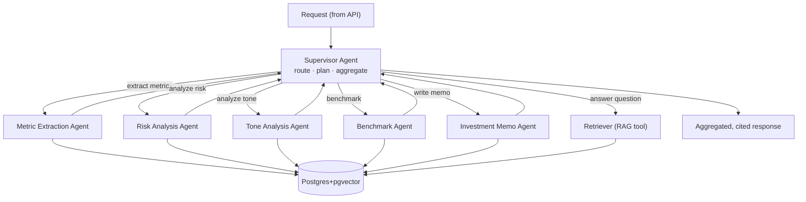
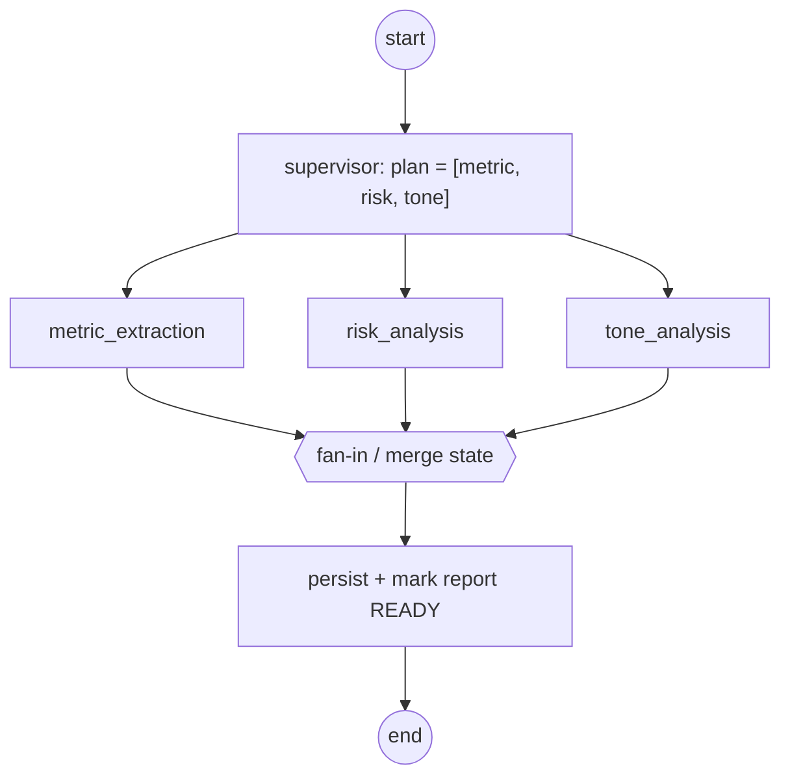
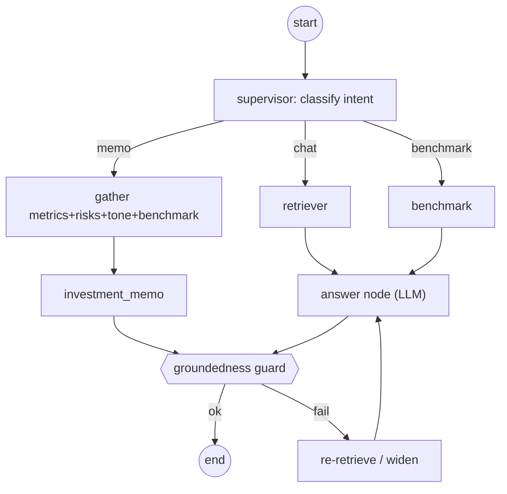
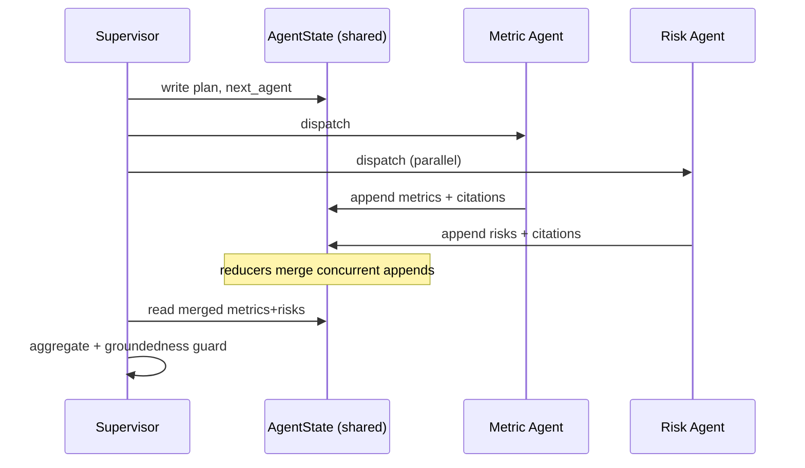
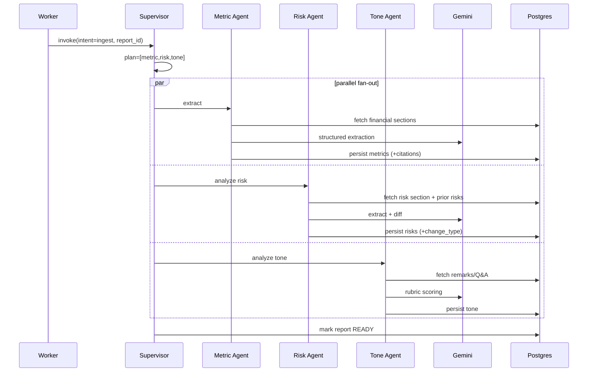
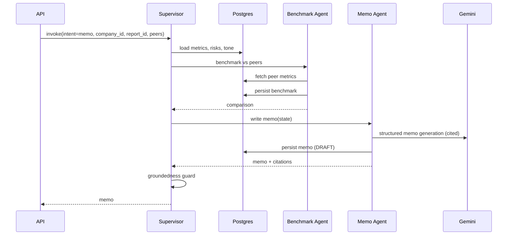

# 03 — Agent Design

> **Document status:** Phase 0 (Foundation)
> **Last updated:** 2026-06-10
> **Framework:** LangGraph (stateful, checkpointed multi-agent orchestration)
> **Primary LLM:** Gemini 2.5 Pro · **Fallback:** GPT-4o (OpenRouter)
> **Audience:** GenAI engineers, reviewers

---

## Table of Contents

1. [Agent Architecture](#1-agent-architecture)
2. [Why LangGraph](#2-why-langgraph)
3. [Shared State Definition](#3-shared-state-definition)
4. [The Agents](#4-the-agents)
   - [4.1 Supervisor](#41-supervisor-agent)
   - [4.2 Metric Extraction](#42-metric-extraction-agent)
   - [4.3 Risk Analysis](#43-risk-analysis-agent)
   - [4.4 Tone Analysis](#44-tone-analysis-agent)
   - [4.5 Benchmark](#45-benchmark-agent)
   - [4.6 Investment Memo](#46-investment-memo-agent)
5. [LangGraph Workflow](#5-langgraph-workflow)
6. [Agent Communication & State Flow](#6-agent-communication--state-flow)
7. [Sequence Diagrams](#7-sequence-diagrams)
8. [Prompting Strategy](#8-prompting-strategy)
9. [Reliability, Fallback & Cost](#9-reliability-fallback--cost)
10. [Assumptions & Constraints](#10-assumptions--constraints)

---

## 1. Agent Architecture

The system uses a **supervisor / specialist** topology. A single **Supervisor** receives a request, decides which specialist(s) are needed, dispatches work, and aggregates results. Specialists are **single-responsibility** — each owns exactly one analytical capability and shares nothing with siblings except the common state object.



**Two execution modes:**

1. **Ingestion-time (batch):** when a document becomes available, the Supervisor fans out Metric + Risk + Tone agents in parallel to populate the structured tables.
2. **Query-time (interactive):** for chat/benchmark/memo requests, the Supervisor routes to the relevant specialist(s) and/or the retriever and streams a grounded answer.

---

## 2. Why LangGraph

| Need | LangGraph feature |
|---|---|
| Resumable, long analyses | **Checkpointer** persists state per node; reruns resume from last good step |
| Auditability | Every node transition is logged → replayable traces |
| Parallel specialists | Graph fan-out / fan-in edges |
| Conditional routing | Supervisor uses **conditional edges** to pick agents |
| Shared, typed state | Single `TypedDict`/Pydantic state passed between nodes |
| Human-in-the-loop | Interrupt/resume for low-confidence review (Phase 11) |

The checkpointer is backed by Postgres (same datastore), so agent state lives next to the data it reasons over.

---

## 3. Shared State Definition

All nodes read from and write to one typed state object. Reducers (e.g. list-append) define how concurrent writes merge.

```python
from typing import TypedDict, Annotated, Literal, Optional
from operator import add

class Citation(TypedDict):
    chunk_id: str
    report_id: str
    quote: str
    page_number: Optional[int]

class AgentState(TypedDict):
    # ---- request context ----
    request_id: str
    intent: Literal["ingest", "chat", "metrics", "risks",
                    "tone", "benchmark", "memo"]
    company_id: Optional[str]
    report_id: Optional[str]
    question: Optional[str]            # for chat
    peer_company_ids: list[str]        # for benchmark

    # ---- routing / plan ----
    plan: list[str]                    # ordered agent names the supervisor chose
    next_agent: Optional[str]

    # ---- shared working memory (merge via reducers) ----
    retrieved_context: Annotated[list[dict], add]
    metrics: Annotated[list[dict], add]
    risks: Annotated[list[dict], add]
    tone: Annotated[list[dict], add]
    benchmark: Optional[dict]
    citations: Annotated[list[Citation], add]

    # ---- output ----
    answer: Optional[str]
    memo: Optional[dict]

    # ---- control / observability ----
    errors: Annotated[list[str], add]
    model_used: Optional[str]          # 'gemini-2.5-pro' | 'gpt-4o'
    token_cost: Annotated[list[dict], add]
    groundedness_ok: Optional[bool]
```

**Reducer rationale:** specialists running in parallel each append to `metrics`/`risks`/`tone`/`citations`; the `add` reducer concatenates without races. Scalar fields (`answer`, `benchmark`) are written by a single owner node.

---

## 4. The Agents

For each agent: **responsibility · inputs · outputs · prompting · tools**.

### 4.1 Supervisor Agent

- **Responsibility:** interpret intent, build a plan (which specialists, in what order, parallel vs sequential), dispatch, aggregate, run the final groundedness guard.
- **Inputs:** `intent`, `company_id`/`report_id`/`question`, available context.
- **Outputs:** `plan`, `next_agent`, and (after fan-in) the assembled `answer`/`memo` with merged `citations`.
- **Prompting:** a routing prompt that maps intent → agent set; mostly deterministic with an LLM tie-breaker for ambiguous chat intents. Does **not** do domain extraction itself.
- **Tools:** none directly — it orchestrates other nodes.

### 4.2 Metric Extraction Agent

- **Responsibility:** extract typed financial KPIs (revenue, gross margin, operating income, EPS, cash flow, etc.) from filing sections, normalize units/periods, attach citations, and compute YoY/QoQ **deterministically** (the maths is done in code/SQL, the LLM only *locates and reads* the numbers).
- **Inputs:** `report_id`, relevant sections/chunks (financial statements, MD&A, tables).
- **Outputs:** rows for `financial_metrics` (each with `metric_key`, `value`, `unit`, period, `confidence`, `source_chunk_id`).
- **Prompting:** structured-output extraction. Forced JSON schema. Explicit instruction: *"Extract only values present in the provided text. For each value, return the exact source quote and chunk_id. If a value is not present, omit it — never infer."*
- **Tools:** `retrieve_sections`, `read_table`, `persist_metrics`. Arithmetic deltas computed by a `compute_growth()` Python function, **not** the LLM.

### 4.3 Risk Analysis Agent

- **Responsibility:** extract discrete risk factors (title, category, severity, summary) from *Item 1A* and MD&A; classify; and **track evolution** by diffing against the prior period's risks (NEW / REMOVED / MODIFIED / UNCHANGED), linking via `prev_risk_id`.
- **Inputs:** `report_id`, risk-section chunks, plus prior-period `risk_factors` for the same company.
- **Outputs:** rows for `risk_factors` with `change_type` and `prev_risk_id` populated.
- **Prompting:** two-stage — (1) extract current-period risks as structured items with citations; (2) align current vs prior risks (semantic matching) and label changes. Severity calibrated against an explicit rubric.
- **Tools:** `retrieve_sections`, `fetch_prior_risks`, `persist_risks`.

### 4.4 Tone Analysis Agent

- **Responsibility:** score management sentiment, confidence, and uncertainty per segment (prepared remarks vs Q&A vs MD&A), surfacing hedging language and forward-looking statements.
- **Inputs:** `report_id`, transcript/MD&A chunks (with `speaker` metadata for transcripts).
- **Outputs:** rows for `tone_analysis` (`sentiment_score`, `confidence_score`, `uncertainty_score`, `signals` JSONB), plus optional trend vs prior periods.
- **Prompting:** rubric-anchored scoring (each score band defined with examples) to reduce variance; returns the specific phrases that drove the score for citation.
- **Tools:** `retrieve_sections`, `persist_tone`.

### 4.5 Benchmark Agent

- **Responsibility:** compare a target company against selected peers on comparable metrics; align terminology, normalize units/periods, rank, and compute percentiles.
- **Inputs:** `company_id`, `peer_company_ids`, `metric_key`(s), period.
- **Outputs:** `benchmark` object → cached in `benchmark_results`; comparison + ranking + percentile.
- **Prompting:** mostly **deterministic** (pulls structured metrics and computes). LLM used only to resolve metric-name ambiguity across companies ("net sales" ≡ "revenue") and to write a short comparative narrative.
- **Tools:** `fetch_metrics(company, peers)`, `align_metrics`, `compute_ranking`, `persist_benchmark`.

### 4.6 Investment Memo Agent

- **Responsibility:** synthesize a structured, fully-cited investment memo: thesis, key metrics + trends, risk summary, management tone, peer positioning, and a recommendation (BUY/HOLD/SELL/WATCH).
- **Inputs:** aggregated `metrics`, `risks`, `tone`, `benchmark`, plus retrieved context for the thesis.
- **Outputs:** `memo` object → `investment_memos` (sections JSONB + citations + recommendation).
- **Prompting:** template-structured generation. Every claim must reference a citation already in state; the agent is forbidden from introducing facts not present in `metrics`/`risks`/`tone`/`context`. Recommendation must be justified by cited evidence.
- **Tools:** consumes upstream state + `retrieve_context`, `persist_memo`. Does not re-extract.

---

## 5. LangGraph Workflow

### 5.1 Ingestion graph (batch, parallel fan-out)



### 5.2 Query graph (interactive, conditional routing)



The conditional edge out of `supervisor` is driven by `state.intent`. The groundedness guard is a conditional edge that loops back (bounded retries) if the answer isn't supported by citations, otherwise terminates.

---

## 6. Agent Communication & State Flow

- **No direct agent-to-agent calls.** Communication is *through shared state* — the canonical LangGraph pattern. This keeps agents decoupled and the flow inspectable.
- **Supervisor owns routing**; specialists own their slice of state.
- **Parallel writes** to list fields use reducers (§3) so fan-out is race-free.
- **Checkpointing** after each node means a failed Tone agent doesn't lose completed Metric/Risk work — the graph resumes from the checkpoint.
- **Citations are cumulative**: every specialist appends the citations backing its outputs, so the memo/answer can render a complete provenance trail.



---

## 7. Sequence Diagrams

### 7.1 Ingestion (parallel specialists)



### 7.2 Memo generation (sequential synthesis)



---

## 8. Prompting Strategy

| Principle | Application |
|---|---|
| **Structured output** | All extraction agents emit JSON validated against a schema (function/tool calling). Invalid JSON → retry with the validator error. |
| **Grounding-first** | Prompts forbid using knowledge outside provided context; require a source quote + chunk_id per claim. |
| **Rubric anchoring** | Tone & severity scoring use explicit, example-backed rubrics to cut variance. |
| **Deterministic maths** | LLMs read numbers; Python/SQL computes growth, ratios, rankings. |
| **Few-shot for hard formats** | Table extraction and risk-diff prompts carry curated few-shot examples. |
| **Prompt versioning** | Every prompt has a version id logged with each call for reproducibility/A-B. |
| **Refusal path** | "If the evidence is insufficient, return `insufficient_evidence: true` rather than guessing." |

Prompt templates live under `backend/prompts/` (one file per agent + version), and the version id is written to `token_cost`/trace logs.

---

## 9. Reliability, Fallback & Cost

- **Primary → fallback:** Gemini 2.5 Pro is primary; on timeout, error, or failed validation, the LLM gateway retries on **GPT-4o via OpenRouter**. `model_used` records which served the response.
- **Validation cross-check:** for high-stakes outputs (memo recommendation, flagged metrics), the fallback model can be used as an independent validator.
- **Bounded retries:** structured-output retries and groundedness re-retrieval are capped to protect latency/cost.
- **Cost accounting:** every LLM call appends `{model, prompt_tokens, completion_tokens, cost}` to `token_cost`; aggregated per request and per document.
- **Checkpoint recovery:** partial failures resume from the last checkpoint rather than restarting the whole graph.
- **Low-confidence flagging:** extractions below a confidence threshold are flagged for human review (Phase 11 human-in-the-loop interrupt).

---

## 10. Assumptions & Constraints

**Assumptions**
- Sections are correctly identified upstream (ingestion sectioner) so agents receive the right context.
- Prior-period data exists for evolution/trend features (graceful "first period" handling otherwise).
- Structured output (tool calling) is reliably supported by both providers.

**Constraints**
- Agents never write outside their owned tables.
- No financial arithmetic by the LLM — deterministic code only.
- No claim without a citation already present in state.
- Total per-request agent count and retries are bounded for cost/latency.

See `05_RETRIEVAL_DESIGN.md` for the retriever tool the agents call, and `04_API_DESIGN.md` for how requests reach the Supervisor.
