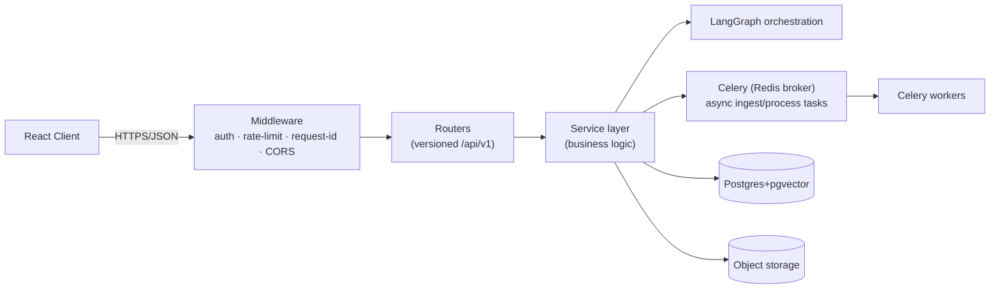
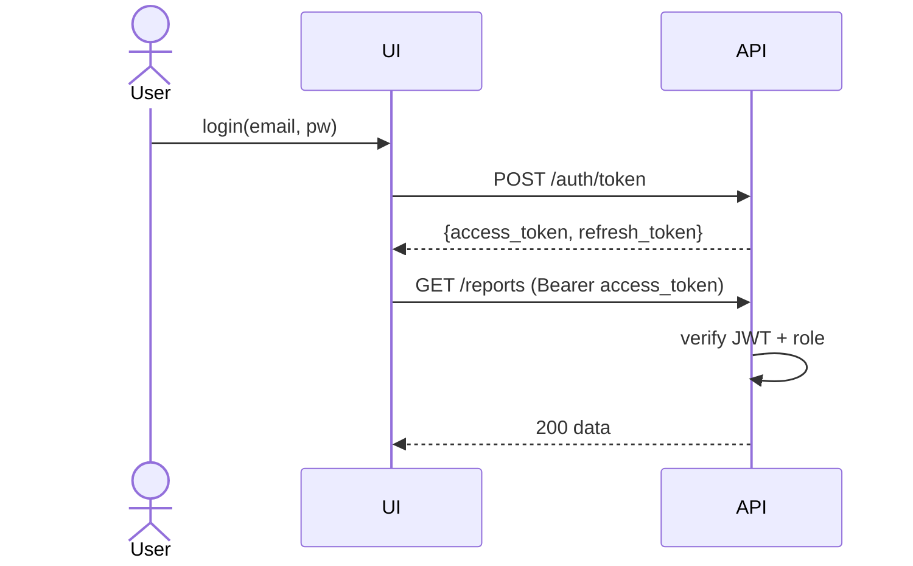
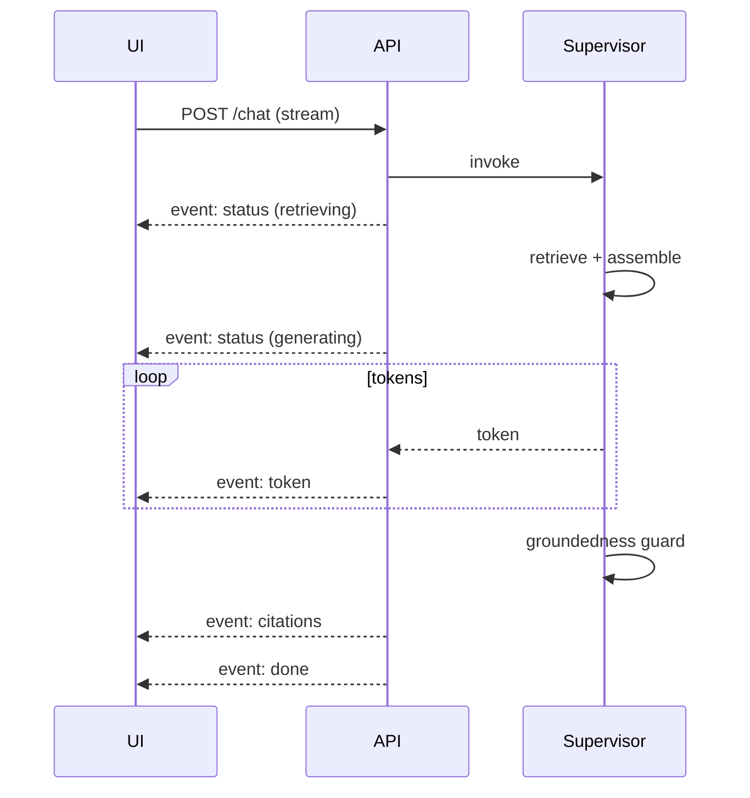

# 04 — API Design

> **Document status:** Phase 0 (Foundation)
> **Last updated:** 2026-06-10
> **Framework:** FastAPI (async) · Pydantic v2 · OpenAPI 3.1
> **Audience:** Backend & frontend engineers, integrators, reviewers

---

## Table of Contents

1. [API Architecture](#1-api-architecture)
2. [Conventions](#2-conventions)
3. [Authentication & Authorization](#3-authentication--authorization)
4. [Validation Strategy](#4-validation-strategy)
5. [Error Handling](#5-error-handling)
6. [Route Catalog](#6-route-catalog)
7. [Endpoint Specifications](#7-endpoint-specifications)
8. [Streaming (Chat)](#8-streaming-chat)
9. [Rate Limiting & Idempotency](#9-rate-limiting--idempotency)
10. [Assumptions & Constraints](#10-assumptions--constraints)

---

## 1. API Architecture

FastAPI is the single ingress to the platform. It is **stateless** (horizontally scalable), validates all I/O with Pydantic, authenticates every request, kicks off async jobs for long-running work, and streams chat via SSE.



**Layering:** routers (HTTP) → services (logic) → orchestration/data. Routers never contain business logic; services never touch the request/response objects.

**Async boundary (Redis + Celery — ADR-008):** any operation that parses, chunks, embeds, or runs extraction is dispatched as a **Celery task** over a **Redis** broker and executed by background workers — *never* synchronously inside a request. Endpoints that trigger such work return `202 Accepted` with a `report_id`, and the client tracks progress via `GET /reports/{id}/process` (poll or SSE). This keeps request latency bounded and gives us retries, monitoring, and worker autoscaling.

---

## 2. Conventions

- **Base path:** `/api/v1`. Breaking changes → `/api/v2`.
- **Content type:** `application/json` (uploads use `multipart/form-data`; chat responses use `text/event-stream`).
- **IDs:** UUID strings.
- **Timestamps:** ISO-8601 UTC (`2026-06-10T14:30:00Z`).
- **Money:** numeric value + explicit `unit` (e.g. `"USD_MILLIONS"`); never bare floats without unit.
- **Pagination:** cursor-based — `?limit=&cursor=`; responses include `next_cursor`.
- **Naming:** resources plural (`/reports`), actions as sub-paths (`/reports/{id}/process`).
- **Every response** includes `X-Request-Id` for tracing.

---

## 3. Authentication & Authorization

- **AuthN:** JWT bearer tokens (`Authorization: Bearer <jwt>`). Short-lived access token + refresh token. OAuth2 password/client-credentials flow via FastAPI's `OAuth2`.
- **AuthZ:** role-based (RBAC). Roles: `viewer` (read), `analyst` (read + upload + generate), `admin` (manage users/companies).
- **Resource scoping:** users are scoped to an organization; all queries filter by `org_id` (multi-tenant ready).
- **Raw documents:** never served directly — access via short-lived **signed URLs**.
- **Secrets:** model API keys live server-side only, in a secrets manager — never exposed to the client.



---

## 4. Validation Strategy

- **Pydantic v2 models** for every request body and response. Invalid input → automatic `422` with field-level detail.
- **Constraints in the schema:** enums for `report_type`/`recommendation`, ranges for scores, `Field(...)` length/regex (e.g. ticker `^[A-Z.]{1,6}$`).
- **File validation on upload:** MIME type (`application/pdf`), max size, magic-byte sniff, checksum.
- **Output validation:** response models guarantee shape; agents' structured output is validated before it reaches the response.
- **Defense in depth:** the DB `CHECK` constraints (see `02_DATABASE_DESIGN.md`) are the last line; API validation is the first.

---

## 5. Error Handling

Consistent error envelope for all non-2xx:

```json
{
  "error": {
    "code": "REPORT_NOT_READY",
    "message": "Report is still processing; metrics are not yet available.",
    "details": { "report_id": "2222...", "status": "EMBEDDING" },
    "request_id": "req_01J..."
  }
}
```

| HTTP | When | Example `code` |
|---|---|---|
| 400 | Malformed request | `BAD_REQUEST` |
| 401 | Missing/invalid token | `UNAUTHENTICATED` |
| 403 | Authenticated but not allowed | `FORBIDDEN` |
| 404 | Resource not found | `REPORT_NOT_FOUND` |
| 409 | Conflict (duplicate upload) | `DUPLICATE_DOCUMENT` |
| 422 | Validation error | `VALIDATION_ERROR` |
| 429 | Rate limited | `RATE_LIMITED` |
| 503 | Both LLM providers unavailable | `MODEL_UNAVAILABLE` |
| 500 | Unexpected | `INTERNAL_ERROR` |

- **Domain-specific 409/425:** `REPORT_NOT_READY` (425 Too Early) when querying metrics before processing completes.
- **Never leak internals:** stack traces are logged with the `request_id`, not returned.

---

## 6. Route Catalog

| Method | Path | Purpose | Role |
|---|---|---|---|
| POST | `/api/v1/auth/token` | Obtain tokens | public |
| POST | `/api/v1/upload` | Upload a document | analyst |
| POST | `/api/v1/reports/{id}/process` | (Re)trigger processing | analyst |
| GET | `/api/v1/reports/{id}` | Report status & meta | viewer |
| GET | `/api/v1/reports/{id}/process` | Processing status (poll/SSE) | viewer |
| POST | `/api/v1/search` | Semantic search over chunks | viewer |
| GET | `/api/v1/reports/{id}/metrics` | Extracted metrics + YoY/QoQ | viewer |
| GET | `/api/v1/reports/{id}/risks` | Risk factors + evolution | viewer |
| POST | `/api/v1/benchmark` | Peer comparison | analyst |
| POST | `/api/v1/memos` | Generate investment memo | analyst |
| GET | `/api/v1/memos/{id}` | Fetch a memo | viewer |
| POST | `/api/v1/chat` | Grounded conversational Q&A (stream) | viewer |
| POST | `/api/v1/export` | Export memo/report (PDF/JSON) | viewer |

---

## 7. Endpoint Specifications

### 7.1 `POST /upload`

Multipart upload. Returns immediately with a report id; processing is async.

**Request:** `multipart/form-data`
```
file:          <binary PDF>
company_ticker: "ACME"
report_type:    "10-Q"
fiscal_year:    2026
fiscal_quarter: 1
```

**Response `202 Accepted`:**
```json
{
  "report_id": "22222222-2222-2222-2222-222222222222",
  "status": "PENDING",
  "checksum": "sha256:9f2b...e1",
  "duplicate": false
}
```
- `409 DUPLICATE_DOCUMENT` if checksum already exists (returns existing `report_id`).

### 7.2 `GET /reports/{id}/process`

**Response `200`:**
```json
{
  "report_id": "2222...",
  "status": "EMBEDDING",
  "progress": { "parsed": true, "chunks": 412, "embedded": 280, "extracted": false },
  "updated_at": "2026-06-10T14:31:05Z"
}
```
SSE variant streams `status`/`progress` events until `READY` or `FAILED`.

### 7.3 `POST /search`

**Request:**
```json
{
  "query": "drivers of gross margin decline",
  "filters": { "ticker": "ACME", "fiscal_year": 2026, "fiscal_quarter": 1,
               "section_code": "MD&A" },
  "top_k": 10
}
```
**Response `200`:**
```json
{
  "results": [
    {
      "chunk_id": "c-abc",
      "score": 0.83,
      "content": "Gross margin declined to 38.2% ...",
      "metadata": { "section_code": "MD&A", "page_number": 14 }
    }
  ],
  "next_cursor": null
}
```

### 7.4 `GET /reports/{id}/metrics`

**Response `200`:**
```json
{
  "report_id": "2222...",
  "period": { "fiscal_year": 2026, "fiscal_quarter": 1 },
  "metrics": [
    {
      "metric_key": "revenue",
      "metric_name": "Total Revenue",
      "value": 1284.0, "unit": "USD_MILLIONS",
      "yoy_pct": 7.4, "qoq_pct": -2.1,
      "confidence": 0.98,
      "citation": { "chunk_id": "c-abc", "page_number": 22,
                    "quote": "Total revenue was $1,284 million ..." }
    },
    {
      "metric_key": "gross_margin",
      "metric_name": "Gross Margin",
      "value": 38.2, "unit": "PERCENT",
      "yoy_pct": -3.3, "qoq_pct": -1.8, "confidence": 0.95,
      "citation": { "chunk_id": "c-def", "page_number": 14,
                    "quote": "Gross margin declined to 38.2% ..." }
    }
  ]
}
```
- `425 REPORT_NOT_READY` if status ≠ `READY`.

### 7.5 `GET /reports/{id}/risks`

**Response `200`:**
```json
{
  "report_id": "2222...",
  "risks": [
    {
      "title": "Supply chain concentration",
      "category": "OPERATIONAL", "severity": "HIGH",
      "change_type": "NEW",
      "summary": "Single-source dependency on a key semiconductor supplier ...",
      "confidence": 0.91,
      "citation": { "chunk_id": "c-ghi", "page_number": 31 }
    }
  ],
  "evolution_summary": { "new": 2, "removed": 1, "modified": 3, "unchanged": 18 }
}
```

### 7.6 `POST /benchmark`

**Request:**
```json
{
  "company_id": "1111...",
  "peer_company_ids": ["aaaa...", "bbbb...", "cccc..."],
  "metric_keys": ["revenue", "gross_margin", "operating_margin"],
  "period": { "fiscal_year": 2025, "period_type": "FY" }
}
```
**Response `200`:**
```json
{
  "period_label": "FY2025",
  "comparisons": [
    {
      "metric_key": "gross_margin",
      "company": { "ticker": "ACME", "value": 38.2, "rank": 3, "percentile": 50 },
      "peers": [
        { "ticker": "PEER1", "value": 44.1, "rank": 1 },
        { "ticker": "PEER2", "value": 41.0, "rank": 2 },
        { "ticker": "PEER3", "value": 35.7, "rank": 4 }
      ],
      "narrative": "ACME trails PEER1/PEER2 on gross margin ..."
    }
  ]
}
```

### 7.7 `POST /memos`

**Request:**
```json
{
  "company_id": "1111...",
  "report_id": "2222...",
  "peer_company_ids": ["aaaa...", "bbbb..."],
  "style": "concise"
}
```
**Response `201`:**
```json
{
  "memo_id": "mmmm...",
  "recommendation": "HOLD",
  "sections": {
    "thesis": "...",
    "key_metrics": "...",
    "risks": "...",
    "management_tone": "...",
    "peer_positioning": "...",
    "valuation_notes": "..."
  },
  "citations": [
    { "chunk_id": "c-abc", "report_id": "2222...", "quote": "Total revenue ..." }
  ],
  "status": "DRAFT"
}
```

### 7.8 `POST /chat`

See [Streaming](#8-streaming-chat).

### 7.9 `POST /export`

**Request:**
```json
{ "resource_type": "memo", "resource_id": "mmmm...", "format": "pdf" }
```
**Response `200`:** `{ "download_url": "https://.../signed?...", "expires_at": "..." }`
Formats: `pdf` | `json` | `md`.

---

## 8. Streaming (Chat)

`POST /api/v1/chat` returns `text/event-stream`. Tokens stream as they are generated; citations are sent as a final structured event so the UI can render inline references.

**Request:**
```json
{
  "session_id": "sess-123",
  "company_id": "1111...",
  "report_id": "2222...",
  "message": "Why did operating margin drop this quarter?"
}
```

**SSE event sequence:**
```
event: status
data: {"phase":"retrieving"}

event: status
data: {"phase":"generating","model":"gemini-2.5-pro"}

event: token
data: {"text":"Operating margin fell "}

event: token
data: {"text":"primarily because ..."}

event: citations
data: {"citations":[{"chunk_id":"c-def","page_number":14,
        "quote":"Gross margin declined to 38.2% ..."}]}

event: done
data: {"groundedness_ok":true,"token_cost":{"model":"gemini-2.5-pro","total":1840}}
```



If groundedness fails after bounded retries, the final answer is an explicit *"insufficient evidence in the provided documents"* message — never a fabricated answer.

---

## 9. Rate Limiting & Idempotency

- **Rate limiting:** per-token sliding window (e.g. 60 req/min default; chat & memo lower). `429` with `Retry-After`.
- **Idempotency:** uploads dedupe via checksum; mutating POSTs accept an `Idempotency-Key` header so client retries don't double-create (memos, benchmarks).
- **Timeouts:** model calls bounded; long jobs are async (`202` + status polling), never blocking HTTP.

---

## 10. Assumptions & Constraints

**Assumptions**
- Clients are authenticated; no anonymous public access in early phases.
- Frontend handles SSE; falls back to polling if SSE unsupported.
- Object storage issues signed URLs.

**Constraints**
- No endpoint returns a financial claim without a citation field.
- No synchronous endpoint performs document processing (always async).
- All enums/ranges validated at the API boundary *and* the DB.
- API keys for models never cross the network to the client.

See `01_ARCHITECTURE.md` for system context, `03_AGENT_DESIGN.md` for what `/chat`, `/memos`, and `/benchmark` invoke, and `05_RETRIEVAL_DESIGN.md` for `/search`.
