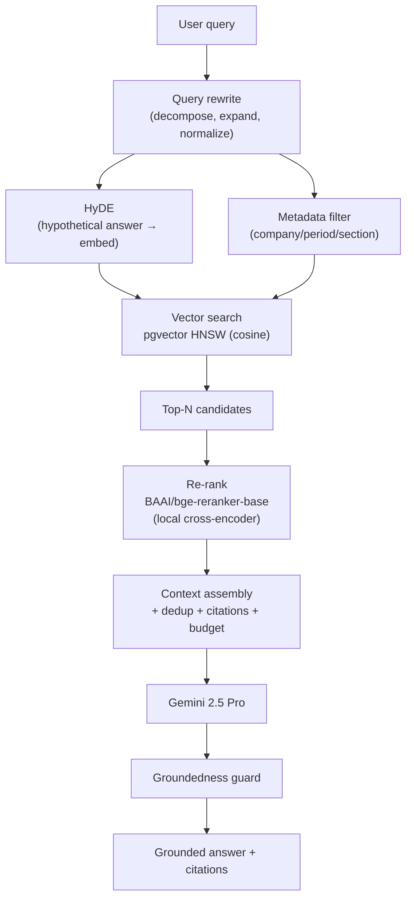
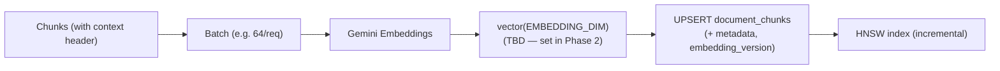
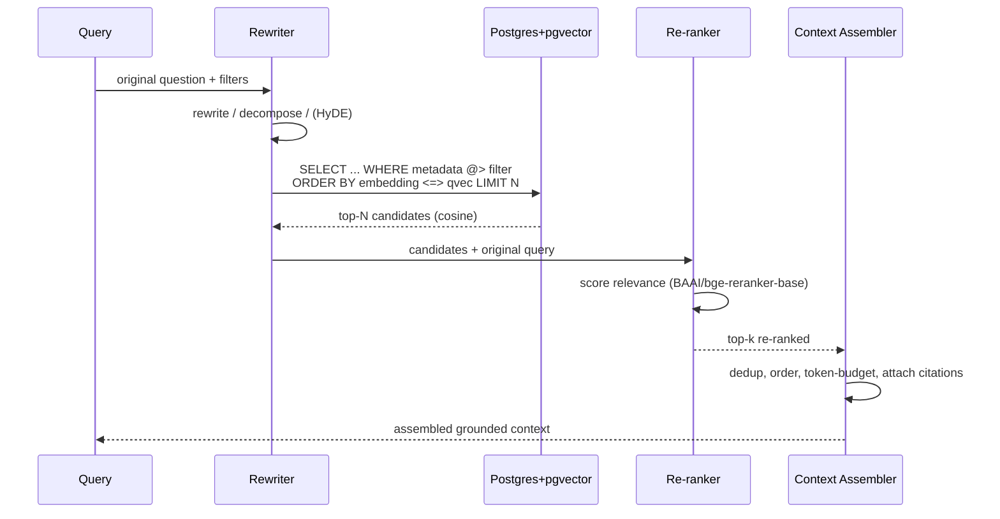
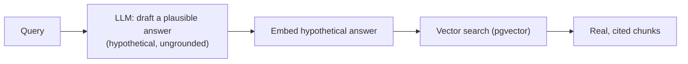
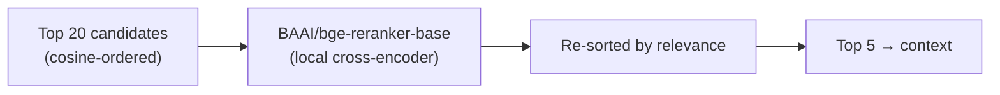
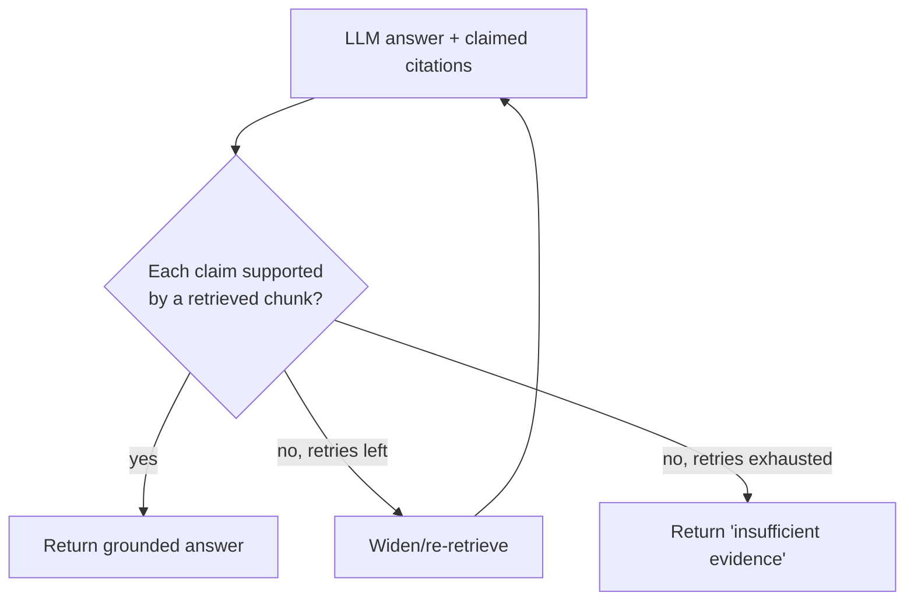
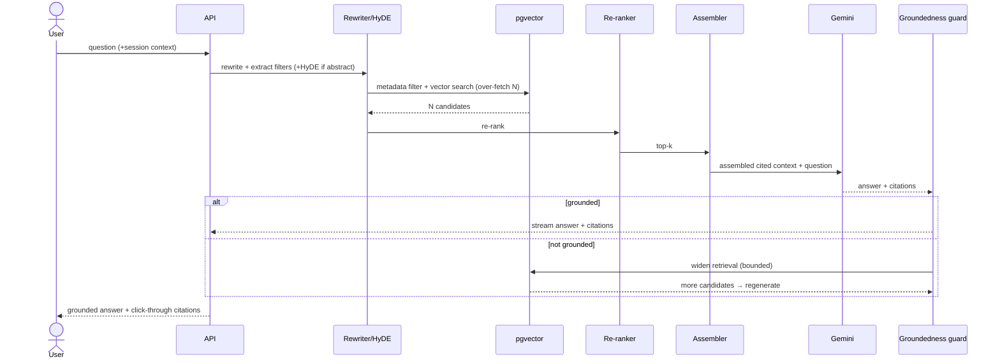

# 05 — Retrieval (RAG) Design

> **Document status:** Phase 0 (Foundation)
> **Last updated:** 2026-06-10
> **Stack:** Gemini Embeddings · PostgreSQL + pgvector (HNSW) · hybrid retrieval
> **Audience:** GenAI / retrieval engineers, reviewers

---

## Table of Contents

1. [RAG Architecture](#1-rag-architecture)
2. [Chunking Strategy](#2-chunking-strategy)
3. [Embedding Pipeline](#3-embedding-pipeline)
4. [Retrieval Flow (Hybrid)](#4-retrieval-flow-hybrid)
5. [Query Rewriting](#5-query-rewriting)
6. [HyDE](#6-hyde-hypothetical-document-embeddings)
7. [Metadata Filtering](#7-metadata-filtering)
8. [Re-ranking](#8-re-ranking)
9. [Context Assembly](#9-context-assembly)
10. [Hallucination Prevention](#10-hallucination-prevention)
11. [Sequence Diagrams](#11-sequence-diagrams)
12. [Assumptions & Constraints](#12-assumptions--constraints)

---

## 1. RAG Architecture

Retrieval is **hybrid**: a cheap, highly selective **metadata pre-filter** narrows the candidate set to the right documents/sections, then **vector similarity** ranks semantically within it, followed by **re-ranking** and **citation-aware context assembly**. Query understanding (rewrite + HyDE) sits in front; a groundedness guard sits behind generation.



**Why hybrid (not pure vector):** financial corpora are highly partitioned by company and period. A pure-vector search over everything risks pulling the *right concept from the wrong filing* (e.g. last year's margin discussion). Metadata pre-filtering guarantees we answer about the company/period asked, and vector search finds the right passage within it.

---

## 2. Chunking Strategy

Chunking is **section-aware and structure-preserving**, because financial documents are highly structured and a naive fixed-window split destroys meaning (splitting a table mid-row, or merging *Risk Factors* with *MD&A*).

### Rules

1. **Respect section boundaries** — never let a chunk cross a 10-K/10-Q item boundary (`Item 1A`, `MD&A`, etc.). Section is recorded in `section_id` + metadata.
2. **Tables stay intact** — a financial table is one chunk (or split by logical row groups, never mid-row), tagged `content_type: "table"`, with a serialized representation that preserves headers.
3. **Prose:** ~**500–800 tokens** per chunk with **~15% overlap** to preserve cross-boundary context.
4. **Transcripts:** chunk by **speaker turn / Q&A pair**, tagged with `speaker` and `segment` (`PREPARED_REMARKS` vs `QA`), so tone analysis and retrieval can target the right speaker.
5. **Carry context headers** — prepend a lightweight breadcrumb (`Company · Period · Section`) into the embedded text so a chunk is self-describing for retrieval.

### Examples

**Prose chunk (MD&A):**
```
[ACME · 10-Q · FY2026 Q1 · MD&A]
Gross margin declined to 38.2% in Q1 2026 from 41.5% in Q1 2025, driven by
elevated component costs and an unfavorable product mix. Management expects ...
```

**Table chunk (intact, header-preserving):**
```
[ACME · 10-Q · FY2026 Q1 · Consolidated Statements of Operations]
| ($M)            | Q1 2026 | Q1 2025 |
|-----------------|---------|---------|
| Total revenue   | 1,284   | 1,196   |
| Cost of revenue |   793   |   700   |
| Gross profit    |   491   |   496   |
```

**Transcript chunk (Q&A turn):**
```
[ACME · TRANSCRIPT · FY2026 Q1 · Q&A · Speaker: CFO]
Q (Analyst, Goldman): Can you walk through the margin compression?
A (CFO): Sure. About 200 bps came from component costs, which we view as transitory ...
```

### Why these sizes
500–800 tokens balances retrieval precision (smaller = more targeted) against context completeness (larger = fewer fragmented facts). 15% overlap recovers facts that straddle a boundary without exploding storage. Tables-as-units is non-negotiable in finance — a half-table is worse than useless.

---

## 3. Embedding Pipeline



- **Model:** Gemini Embeddings. The output dimensionality maps to the `vector(EMBEDDING_DIM)` column, where **`EMBEDDING_DIM` is intentionally TBD until Phase 2** — the exact Gemini embedding variant (and thus its dimension) is selected and benchmarked when the knowledge-base pipeline is built. See `02_DATABASE_DESIGN.md` §6.1 for the deferral rationale and migration implications.
- **Batching:** embed in batches to amortize API latency/cost.
- **Versioning:** store `embedding_model` + `embedding_version` in metadata. A model change is a **re-embed migration** (rebuild vectors + HNSW index).
- **Idempotency:** chunk upserts keyed on `(report_id, chunk_index)`.
- **Query embeddings** use the **same model** as document embeddings — mismatched models break similarity.

---

## 4. Retrieval Flow (Hybrid)



**Core query** (metadata pre-filter + ANN):
```sql
SET hnsw.ef_search = 100;
SELECT id, content, metadata,
       1 - (embedding <=> :query_vec) AS cosine_similarity
FROM document_chunks
WHERE metadata @> :filter_jsonb         -- e.g. {"ticker":"ACME","fiscal_year":2026,"fiscal_quarter":1}
ORDER BY embedding <=> :query_vec
LIMIT :n;                                -- N ≈ 30–50 candidates before re-rank
```

Retrieve the **top 20** candidates (over-fetch), re-rank with `BAAI/bge-reranker-base`, and keep the **top 5** for the context window. Canonical pipeline:

```
Query → Hybrid Retrieval → Top 20 chunks → BGE Reranker → Top 5 chunks → Context Assembly → LLM
```

---

## 5. Query Rewriting

Raw user questions are often underspecified or conversational. The rewriter:

- **Resolves coreference / context** from the chat session ("it", "that quarter" → explicit company/period).
- **Decomposes** multi-part questions into sub-queries (each retrieved separately, results merged).
- **Normalizes terminology** to canonical financial terms (e.g. "top line" → "revenue").
- **Extracts filters** from the question to populate the metadata pre-filter (company, period, section hints).

**Example**
```
User:     "How did its margins look vs last year?"  (session: company=ACME, period=2026Q1)
Rewrite:  ["ACME gross margin FY2026 Q1", "ACME operating margin FY2026 Q1",
           "ACME gross margin FY2025 Q1", "ACME operating margin FY2025 Q1"]
Filters:  {ticker: ACME, fiscal_quarter: 1, fiscal_year: [2026, 2025]}
```

---

## 6. HyDE (Hypothetical Document Embeddings)

For abstract or sparse queries, embedding the *question* may not align well with the *answer* text. **HyDE** generates a short hypothetical answer with the LLM, embeds **that**, and searches with it — because a hypothetical answer is lexically/semantically closer to real answer passages than the question is.



- Used **selectively** (abstract/analytical queries), not for every request — it adds an LLM call.
- The hypothetical text is **never shown to the user** and never cited; it's only a retrieval probe. The final answer is grounded strictly in retrieved real chunks.

---

## 7. Metadata Filtering

The pre-filter is the workhorse of precision. Filters map directly to `document_chunks.metadata` (GIN-indexed JSONB):

| Filter | Field | Example |
|---|---|---|
| Company | `ticker` / `company_id` | `"ACME"` |
| Period | `fiscal_year`, `fiscal_quarter` | `2026`, `1` |
| Document type | `report_type` | `"10-Q"` |
| Section | `section_code` | `"MD&A"`, `"ITEM_1A"` |
| Content type | `content_type` | `"table"` for numeric queries |
| Speaker | `speaker` | `"CFO"` (transcripts) |

**Example metadata filter JSON:**
```json
{ "ticker": "ACME", "fiscal_year": 2026, "fiscal_quarter": 1, "section_code": "MD&A" }
```

**Smart defaults:** a numeric/metric question biases the filter toward `content_type: "table"` and financial-statement sections; a risk question targets `ITEM_1A`; a "what did management say" question targets transcript segments.

---

## 8. Re-ranking

Vector similarity is recall-oriented but noisy. A re-ranker reorders the over-fetched candidates by true query relevance before they enter the context window.

### 8.1 Primary re-ranker: `BAAI/bge-reranker-base` *(ratified — see ADR-010)*

The **primary Phase 6 re-ranker is `BAAI/bge-reranker-base`**, a local cross-encoder that scores each `(query, chunk)` pair for relevance.

- **Why BGE (over an LLM scorer or a hosted re-ranker API):**
  - **Strong retrieval performance** — purpose-built cross-encoder, well-benchmarked on passage re-ranking.
  - **Fast** — small model, batch-scores 20 candidates in milliseconds; keeps it inside the critical request path without blowing the chat latency budget.
  - **Cheap** — no per-call token cost; one-time model download.
  - **Deterministic** — same inputs → same scores, so retrieval is reproducible and testable (no temperature, no provider drift).
  - **Runs locally** — no extra network hop, no data leaving the boundary, no provider rate limits on the hot path.

### 8.2 Canonical pipeline

```
Query
  ↓
Hybrid Retrieval (metadata filter + vector search)
  ↓
Top 20 chunks
  ↓
BAAI/bge-reranker-base
  ↓
Top 5 chunks
  ↓
Context Assembly
  ↓
LLM
```



- **Effect:** pushes the genuinely-answering passages to the top, lets us keep `k = 5` small (cheaper, less distraction), and improves groundedness.
- **Tie-breakers:** prefer the same period/section as the query; prefer `table` chunks for numeric questions.

### 8.3 Why LLM re-ranking is *not* the primary approach

LLM-based re-ranking (asking an LLM to score/order candidates) is **explicitly excluded from the critical retrieval path** because it is **slow** (adds an LLM round-trip to every query), **costly** (per-token spend on every retrieval), and **non-deterministic** (scores vary run-to-run, undermining reproducible evaluation). On the hot path these are disqualifying.

LLM re-ranking **may be explored later as an offline evaluation layer** — e.g. to benchmark or audit BGE's rankings, or to label a gold set — but it stays out of the live request flow. The deterministic, local BGE re-ranker is the production path.

---

## 9. Context Assembly

The assembler turns re-ranked chunks into the final LLM context:

1. **Deduplicate** overlapping chunks (from overlap windows).
2. **Order** logically — by section/period, not raw score — so the model reads coherently.
3. **Token-budget** — fit within a target context size; drop lowest-relevance chunks first; never truncate a table mid-row.
4. **Attach citation handles** — each chunk carries `chunk_id`, `report_id`, `page_number`, and a quotable span so the answer can cite precisely.
5. **Label provenance inline** — each context block is prefixed with its source breadcrumb so the model can attribute claims.

**Assembled context block (what the LLM sees):**
```
[SOURCE chunk_id=c-def · ACME · 10-Q · FY2026 Q1 · MD&A · p.14]
Gross margin declined to 38.2% in Q1 2026 from 41.5% in Q1 2025, driven by
elevated component costs and an unfavorable product mix.

[SOURCE chunk_id=c-xyz · ACME · 10-Q · FY2026 Q1 · Statements of Operations · p.7]
| ($M) | Q1 2026 | Q1 2025 |
| Total revenue | 1,284 | 1,196 |
| Gross profit  |   491 |   496 |
```

The generation prompt instructs the model to cite by `chunk_id`, which the API maps back to full citation objects for the client.

---

## 10. Hallucination Prevention

Hallucination is the cardinal sin in finance. Defenses are layered:

| Layer | Mechanism |
|---|---|
| **Grounding mandate** | Prompts forbid using any fact not in the provided context; require a `chunk_id` per claim. |
| **Refusal path** | "If the context does not contain the answer, say so" → returns *insufficient evidence* instead of guessing. |
| **Deterministic maths** | Growth %, ratios, rankings computed in code/SQL, never by the LLM (eliminates arithmetic hallucination). |
| **Groundedness guard** | Post-generation check: every claim/citation is verified to be supported by a retrieved chunk; unsupported claims trigger bounded re-retrieval or removal. |
| **Citation requirement** | API responses must carry citations; the UI renders click-through to source. A citation-less financial answer is rejected. |
| **Confidence surfacing** | Extracted metrics/risks carry confidence; low-confidence items are flagged, not asserted. |
| **Re-ranking** | Reduces irrelevant context that could seed off-topic generation. |



---

## 11. Sequence Diagrams

### 11.1 End-to-end grounded answer



---

## 12. Assumptions & Constraints

**Assumptions**
- Sectioning is accurate enough that `section_code` filters are reliable.
- Query and document embeddings use the same Gemini model/version.
- Tables are extracted with structure intact upstream (ingestion).

**Constraints**
- Pure-vector (no metadata filter) retrieval is disallowed for company/period-scoped questions.
- No arithmetic by the LLM — deterministic compute only.
- Every served answer carries citations or an explicit insufficient-evidence response.
- Re-embedding on model change is a coordinated migration (vectors + HNSW index).

See `02_DATABASE_DESIGN.md` for the chunk/metadata schema and indexes, `03_AGENT_DESIGN.md` for how agents call the retriever, and `04_API_DESIGN.md` for the `/search` and `/chat` contracts.
